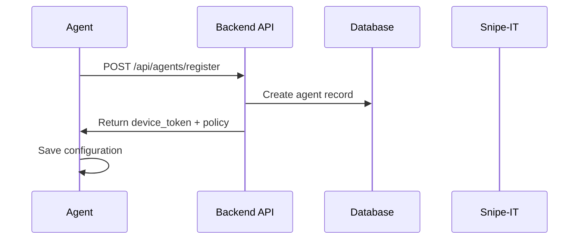
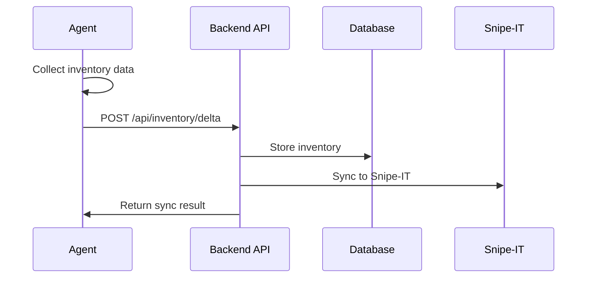
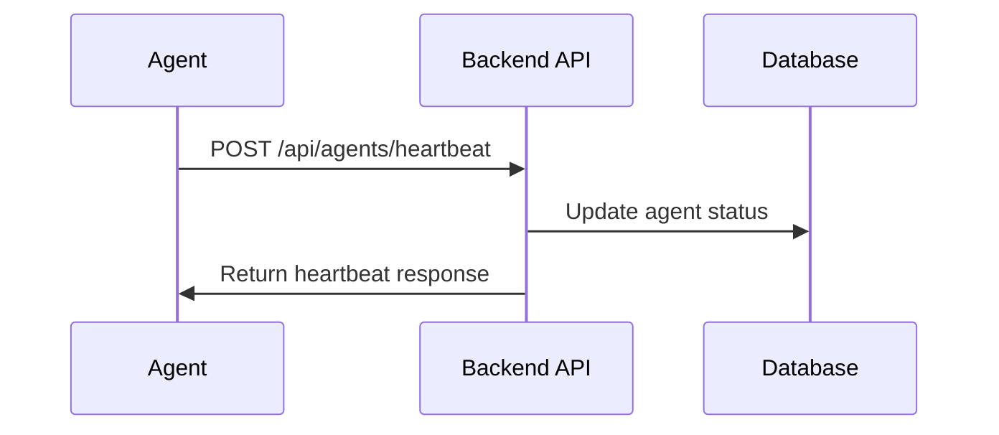

# MeldenIT Agent - Mimari Dokümantasyonu

## Genel Mimari

MeldenIT Agent, Windows bilgisayarlardan envanter verilerini toplayıp Snipe-IT'e entegre eden kapsamlı bir çözümdür. Sistem üç ana bileşenden oluşur:

1. **Windows Agent** - Windows bilgisayarlarda çalışan ajan
2. **Backend API** - Merkez sunucu API'si
3. **Snipe-IT Integration** - Snipe-IT ile entegrasyon

## Bileşen Detayları

### 1. Windows Agent

#### Teknoloji Stack
- **.NET 8** - Modern, performanslı ve güvenli
- **Windows Service** - Arka plan servisi
- **System Tray UI** - Kullanıcı arayüzü
- **WMI & PowerShell** - Sistem bilgisi toplama

#### Mimari Yapı
```
MeldenIT.Agent/
├── Core/                 # Ortak sınıflar ve modeller
├── Service/              # Windows Service bileşeni
├── Tray/                 # System Tray UI
└── Main/                 # Ana uygulama
```

#### Ana Sınıflar
- **InventoryCollector** - Envanter verisi toplama
- **ConfigManager** - Konfigürasyon yönetimi
- **ApiClient** - Backend API iletişimi
- **AgentService** - Ana iş mantığı

### 2. Backend API

#### Teknoloji Stack
- **Python 3.11** - Modern Python
- **FastAPI** - Yüksek performanslı web framework
- **SQLAlchemy** - ORM
- **PostgreSQL** - Veritabanı
- **Redis** - Cache ve session yönetimi

#### Mimari Yapı
```
backend/
├── app/
│   ├── core/            # Temel konfigürasyon
│   ├── models/          # Veritabanı modelleri
│   ├── schemas/         # Pydantic şemaları
│   ├── services/        # İş mantığı servisleri
│   └── api/             # API endpoint'leri
├── migrations/          # Veritabanı migration'ları
└── tests/               # Test dosyaları
```

#### Ana Servisler
- **AgentService** - Agent yönetimi
- **SnipeItService** - Snipe-IT entegrasyonu
- **InventoryService** - Envanter yönetimi

### 3. Veritabanı Şeması

#### Ana Tablolar
- **agents** - Agent kayıtları
- **inventories** - Envanter verileri
- **heartbeats** - Canlılık kayıtları
- **jobs** - İş kuyruğu
- **audit_logs** - Audit kayıtları

## Veri Akışı

### 1. Agent Kaydı


### 2. Envanter Senkronizasyonu


### 3. Heartbeat


## Güvenlik

### 1. Kimlik Doğrulama
- **Device Token** - Her agent için benzersiz token
- **JWT Bearer** - API erişimi için
- **TLS 1.2+** - Tüm iletişim şifreli

### 2. Veri Güvenliği
- **Token Şifreleme** - Windows Credential Manager
- **Sertifika Doğrulama** - SSL/TLS sertifikaları
- **Audit Logging** - Tüm işlemler kayıt altında

### 3. Ağ Güvenliği
- **Proxy Desteği** - Kurumsal proxy ayarları
- **Rate Limiting** - API istek sınırları
- **CORS** - Cross-origin güvenlik

## Performans

### 1. Agent Optimizasyonu
- **Delta Sync** - Sadece değişiklikleri gönder
- **Offline Queue** - Ağ yokken kuyruklama
- **Retry Logic** - Hata durumunda yeniden deneme

### 2. Backend Optimizasyonu
- **Async/Await** - Asenkron işlemler
- **Connection Pooling** - Veritabanı bağlantı havuzu
- **Caching** - Redis cache kullanımı

### 3. Veritabanı Optimizasyonu
- **Indexing** - Performans için indeksler
- **Partitioning** - Büyük tablolar için bölümleme
- **Cleanup** - Eski verilerin temizlenmesi

## Ölçeklenebilirlik

### 1. Horizontal Scaling
- **Load Balancer** - Nginx reverse proxy
- **Multiple Backend** - Birden fazla backend instance
- **Database Replication** - Veritabanı çoğaltma

### 2. Vertical Scaling
- **Resource Monitoring** - Kaynak kullanımı izleme
- **Auto-scaling** - Otomatik ölçeklendirme
- **Performance Tuning** - Performans ayarları

## Monitoring ve Logging

### 1. Logging
- **Structured Logging** - JSON formatında loglar
- **Log Levels** - DEBUG, INFO, WARNING, ERROR
- **Log Rotation** - Log dosyası döndürme

### 2. Monitoring
- **Health Checks** - Servis sağlık kontrolü
- **Metrics** - Performans metrikleri
- **Alerts** - Kritik durumlar için uyarılar

### 3. Observability
- **Distributed Tracing** - İstek takibi
- **APM** - Application Performance Monitoring
- **Error Tracking** - Hata takibi

## Deployment

### 1. Development
- **Local Development** - Docker Compose
- **Hot Reload** - Kod değişikliklerinde otomatik yeniden başlatma
- **Debug Mode** - Geliştirme modu

### 2. Staging
- **Staging Environment** - Test ortamı
- **Integration Tests** - Entegrasyon testleri
- **Performance Tests** - Performans testleri

### 3. Production
- **Blue-Green Deployment** - Sıfır downtime deployment
- **Rollback Strategy** - Geri alma stratejisi
- **Health Checks** - Deployment sonrası sağlık kontrolü

## Disaster Recovery

### 1. Backup Strategy
- **Database Backup** - Günlük veritabanı yedekleme
- **Configuration Backup** - Konfigürasyon yedekleme
- **Code Backup** - Kaynak kod yedekleme

### 2. Recovery Procedures
- **RTO** - Recovery Time Objective
- **RPO** - Recovery Point Objective
- **Failover** - Otomatik yedek sistem

## Compliance

### 1. Data Privacy
- **GDPR Compliance** - Kişisel veri korunması
- **Data Minimization** - Minimum veri toplama
- **Right to be Forgotten** - Unutulma hakkı

### 2. Security Standards
- **ISO 27001** - Bilgi güvenliği yönetimi
- **SOC 2** - Güvenlik kontrolleri
- **Penetration Testing** - Güvenlik testleri
